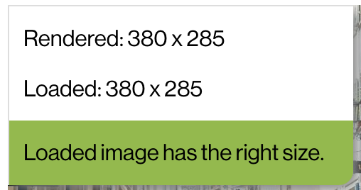
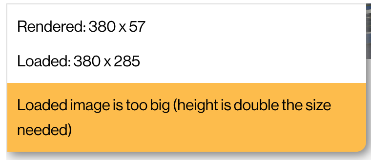
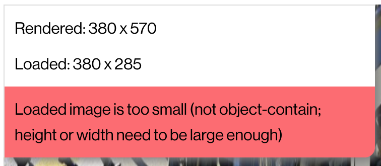

# Show Image Sizes Chrome Extension

This is a Chrome extension which displays on request information about images
loaded on the page. Especially if they are loaded in the rigt size. This is not
too small and not too big.

## How to install

- Download this repo
- Got to `chrome://extensions`
- enable the developer mode in the top right
- click `Load unpacked` and select the downloaded repo.

Also see
https://developer.chrome.com/docs/extensions/get-started/tutorial/hello-world

## Warning

Currently the extension leaves some style changes even after being disabled
again. So reload the page where you used the extension to be sure all original
CSS is there.  
It is of course planned to fix this in the future.
